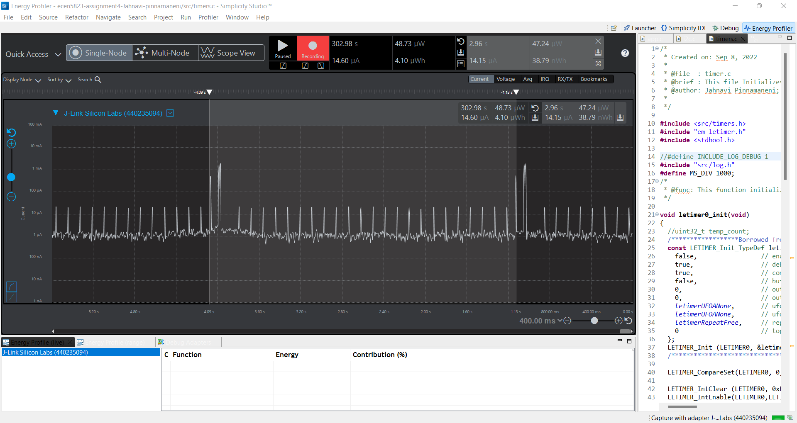
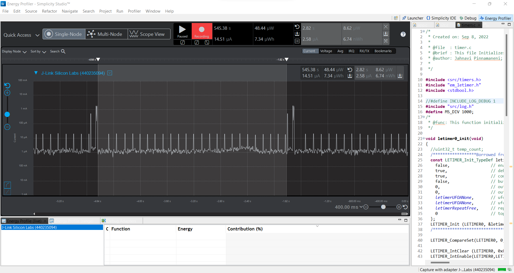
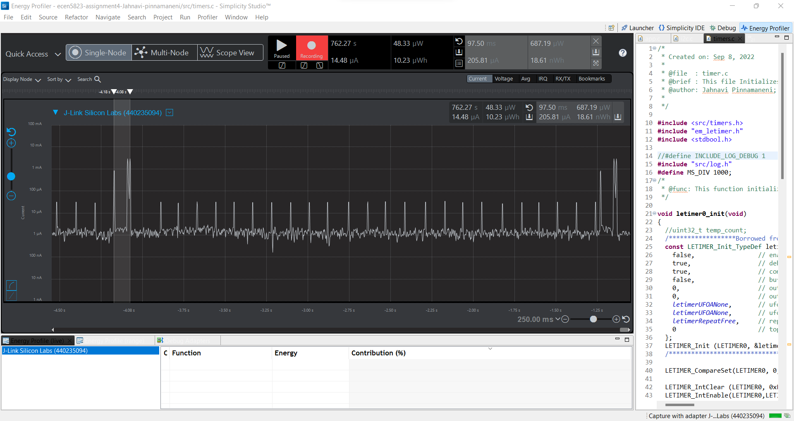
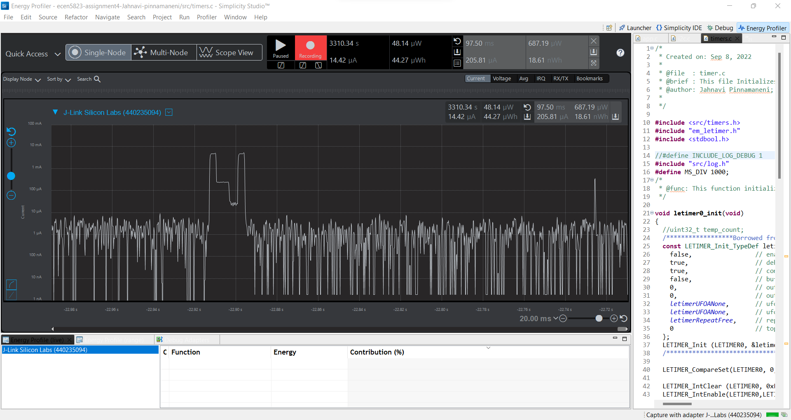

Please include your answers to the questions below with your submission, entering into the space below each question
See [Mastering Markdown](https://guides.github.com/features/mastering-markdown/) for github markdown formatting if desired.

*Be sure to take measurements with logging disabled to ensure your logging logic is not impacting current/time measurements.*

*Please include screenshots of the profiler window detailing each current measurement captured.  See the file Instructions to add screenshots in assignment.docx in the ECEN 5823 Student Public Folder.* 

1. What is the average current per period?
   Answer:***14.15uA***
    Screenshot:  
     

2. What is the average current when the Si7021 is Powered Off?
   Answer:***2.58uA***
    Screenshot:  
     

3. What is the average current when the Si7021 is Powered On?
   Answer:
    Screenshot:***205.81***  
     

4. How long is the Si7021 Powered On for 1 temperature reading?
   Answer:***97.50ms***
    Screenshot:  
     

5. Compute what the total operating time of your design for assignment 4 would be in hours, assuming a 1000mAh battery power supply?
   Answer:(1000 * 1000)/14.15 Ah/A = ***70671 Hours***. Hence the total operating time of this design is 70671 Hours.
   
6. How has the power consumption performance of your design changed since the previous assignment?
   Answer: The power consumption has decreased considerably between Assignment 3 and 4. For instance
		The average power consumed is 494.08uW for Assignment 3 and 47.24uW for Assignment 4 which is approximately 10 times lesser.
		The reason for this difference in power consumption is mainly due to the non-blocking mechanism used in Assignment 4. When the 
		system is waiting for delay time, it is sleeping in EM3 rather than EM0 which was the case in the previous assignment which adds 
		to one of the major reasons of power consumption.
		The second reason is the reduced power consumption by letting the system to sleep in EM1 when waiting for the I2C transfers to happen.

   
7. Describe how you tested your code for EM1 during I2C transfers.
   Answer:  For testing the code in EM1, the energy profiler was majorly used. From the screenshot below we can see that the after the I2C transfer
		the system sleeps in EM1 and then tries to sleep for 11ms in EM3 and wakes upto EM0 for the I2C read.
  

